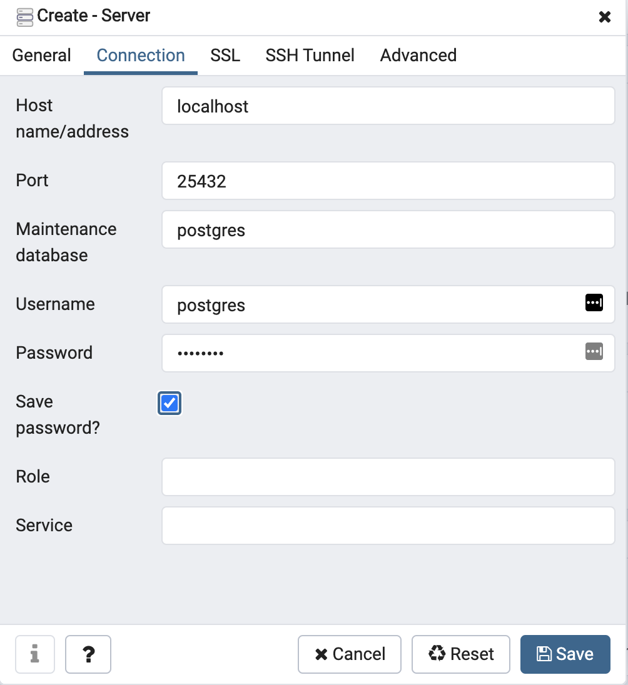

# Assignment: PostGIS Docker Setup

## Objective: Run postgis in a docker container with sample data

In this assignment you will setup geoserver to run in a docker container on your local machine and configure the docker container to use your local disk as a volume to serve the geoserver sample data. 

## Background
PostGIS is an extension to the open source database, PostgreSQL. PostgreSQL, or “postgres”, is released under a special license called the “PostgreSQL License”:

PostgreSQL is released under the PostgreSQL License, a liberal Open Source license, similar to the BSD or MIT licenses.
```
PostgreSQL Database Management System
(formerly known as Postgres, then as Postgres95)

Portions Copyright © 1996-2018, The PostgreSQL Global Development Group

Portions Copyright © 1994, The Regents of the University of California

Permission to use, copy, modify, and distribute this software and its documentation for any purpose, without fee, and without a written agreement is hereby granted, provided that the above copyright notice and this paragraph and the following two paragraphs appear in all copies.
```
PostGIS is released under the GNU General Public License (v2 or later):

``` GNU GENERAL PUBLIC LICENSE
Version 2, June 1991

Copyright (C) 1989, 1991 Free Software Foundation, Inc.
51 Franklin Street, Fifth Floor, Boston, MA 02110-1301 USA

Everyone is permitted to copy and distribute verbatim copies
of this license document, but changing it is not allowed.
```

In a typical scenario, PostGIS would be serving data static and dynamic spatial vector data, providing them to both clients (e.g., QGIS) and middleware (e.g., geoserver). It  would be run as a server on dedicated server hardware, a VM, or a container in a container management service. For the purposes of this class, you will run PostGIS in a docker container on your workstation. This has a number of benefits:
1) It is a clean copy of PostGIS for your exclusive use
2) As a container, the environment will be consistent every time
3) No need to provision dedicated server hardware to run idle when not in use
4) Gain familiarity with docker

## Prerequisites
1) Docker is installed
2) PgAdmin is installed (https://www.pgadmin.org/download/)

## Assignment

### 1) Pull the postgis docker container.

Pull the image as in the instructions to download the latest version:

```
docker pull mdillon/postgis
```

Run the docker container to give yourself a quick test that you have a working container:

```
docker run -p 25432:5432 mdillon/postgis
```

This will run postgis in a container and expose the port `5432` from the docker container as `25432` on your host system (i.e., your Desktop or laptop). It will take a minute for postgresql to start up. Watch the terminal output for a message indicating that Postgresql is running; it will look like this: 
```
2020-11-18 00:31:32.231 UTC [305] LOG:  database system is ready to accept connections
```

Connect to localhost, port 5432 with a postgres host. Use  `pgadmin` for this class.

### 2) Configure postgis to store data on the host rather than the container.

We want to use a local directory to serve sample data through geoserver but in order to do that, we need to do a little housecleaning and prep first.

We need to stop the existing container first. There are a few ways to do this. One is to use Docker Desktop to list the running containers and manually kill/remove it. Another is through the command line with `docker stop` and `docker rm`. For this assignment I'd like you to become more familiar with the command line. 

#### Kill the existing container that is running from step 1
To kill the running container, look at the running docker processes:
```
docker ps
```
Copy the CONTAINER ID for the postgis IMAGE and use it to `rm` the container:
```
docker rm -f CONTAINER_ID
```
Use `docker ps` to see its status and make sure it is not running.

#### Pick a directory to use for this database for the rest of this semester
This is pretty important because we are going to create a place on our local machines to store the data from our database. Create a dedicated directory for this. In my examples below I will use $DATA_DIR to indicate this directory. Note also that anything _AFTER_ the $DATA_DIR is very important for the postgis container because I found this mapping to be somewhat finnicky.

#### Run docker with the volume mapping

_In the following description, `$DATA_DIR` is a variable that refers to a directory of your choosing._

Finally, run the docker container with the volume switch mapping your local directory to the postgis data directory on the container. The important switch here is `-v $DATA_DIR/postgres_data:/var/lib/postgresql` which maps the directory, `$DATA_DIR/postgres_data` on your local computer to the `/var/lib/postgresql` in the container, which is where postgres looks to find its configuration and data files. Your path will likely be different. If you wanted to use a shared network drive named `c:/postgres_data:/var/lib/postgresql`, for example, it might look like: `c:/postgres_data:/var/lib/postgresql`

```
docker run -d --name postgis -v $DATA_DIR/postgres_data/data:/var/lib/postgresql/data -p 25432:5432 mdillon/postgis
```
Breaking that command down:
- `docker run` 
  - is the root command
- `-d` 
  - indicates to run in `detached` mode (in the background)
- `--name postgis` 
  - is how we give the container a name. This will also be the hostname for this container _inside_ the `gist604b` docker network.
- `-v $DATA_DIR/postgres_data/data:/var/lib/postgresql/data` 
  - allows us to mount a local host directory on the container and use it to store our database data. It is really two directories separated by a `:` with the host directory (on your computer) on the left and the container directory on the right. 
  - `$DATA_DIR/postgres_data/data` 
    - the host directory - this should be a path on your machine. You do not need to creeate the `postgres_data` or `data` subdirectories as the container will initialize a clean database the first time it runs.
  - `/var/lib/postgresql/data`
    - the directory in the container where postgresql will store database data. Don't touch this.
- `-p 25432:5432` 
  - is a mapping between the host computer port `25432` and the container port `5432`. Since the container will run the database on `5432`, the port on the right shouldn't change. We can specify a port on the left to be the port that _we_ connect to when we try to connect to the database on our local machine. In this case, we are using `25432`. Why not use the default, `5432`? Exposing on this non-standard port means we can avoid having our docker container ghosted by another server running on your computer. This is not uncommon if you have prefiously installed postgresql on your computer as a service.
- `mdillon/postgis`
  - the name of the container. See https://hub.docker.com/r/mdillon/postgis/ for image details.

### 3) Check your $DATA_DIR
In Explorer or Finder, navigate to `$DATA_DIR/postgres_data/data` and confirm that the directory exists (i.e., it was created by docker i the previous step) and that it is not empty.


_Deliverable: Take a screenshot of your directory listing showing the path/folder name and contents. Name it `data_dir.png`_

### 4)Connect to database
Open pgAdmin. It may prompt you to set a master password. Set it to `postgres` and don't forget it. That's a password to access your pgAdmin GUI. That is NOT the password to the database.

Connect to the local Postgresql database by Right clicking on `Servers` and selecting `New`.


Enter `localhost:25432` for the name


Enter connection details:


Now you should be connected and your pgadmin menu should look like this:


_Deliverable: Take a screenshot of your PgAdmin screen showing the active connection and name it `screenshot_connection.png`_

### 6) Turn in your work via GitHub Pull Request. 

Submit a *Pull request* to merge your `solution` branch with the `master` branch. _Do not merge it yourself_

